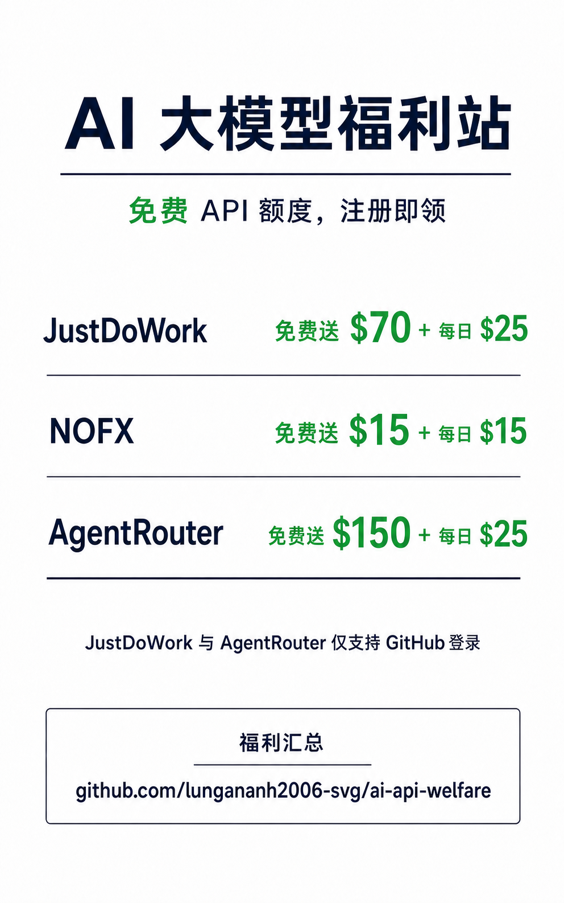

# AI 大模型福利站

AI 编程与 API 调用福利信息汇总。

> 额度、模型和价格会调整，请以平台后台为准。

> [!IMPORTANT]
> **JustDoWork 与 AgentRouter 目前仅支持 GitHub 登录，暂不支持邮箱/密码登录。** 注册前请确认 GitHub 账号可以正常授权。

## JustDoWork

注册送 **$70**，每日签到约 **$25**；仅支持 **GitHub 登录**。

| 模型 | 输入价格 | 输出价格 | 接口 | 说明 |
| --- | ---: | ---: | --- | --- |
| `claude-opus-5` | $0.60 | $0.60 | Anthropic / OpenAI | VIP 按量计费模型，适合日常代码与复杂任务。 |
| `claude-opus-5-thinking` | $0.65 | $0.65 | Anthropic / OpenAI | VIP 按量计费模型，适合需要更强推理能力的复杂任务。 |

[注册 JustDoWork](https://api.justwoker.icu/register?aff=pzPu)

---

## NOFX

注册送 **$15**，每日签到约 **$15**；支持主流模型，按模型倍率扣积分。连续 30 天未调用，剩余积分可能清空。

[注册 NOFX](https://nofx.one/zh-CN/sign-in?ref=EZKHTM7W)

---

## AgentRouter

注册送 **$150**，每日签到约 **$25**；GPT、Claude 定时供应，另有 DeepSeek、GLM 等模型。仅支持 **GitHub 登录**。

| 模型 | 输入价格 | 输出价格 |
| --- | ---: | ---: |
| `gpt-5.6-sol` | $3 / 1M Tokens | $15 / 1M Tokens |
| `claude-opus-4-8` | $8 / 1M Tokens | $40 / 1M Tokens |
| `claude-opus-5` | $8 / 1M Tokens | $40 / 1M Tokens |
| `deepseek-v4-flash` | $2 / 1M Tokens | $6 / 1M Tokens |
| `glm-5.3` | $3 / 1M Tokens | $12 / 1M Tokens |

支持 Anthropic / OpenAI 兼容接口，可接入 Claude Code、Codex、Cline、Cursor 等客户端。

[注册 AgentRouter](https://agentrouter.org/register?aff=o85q)

---

## 免责声明

第三方服务，勿上传 API Key、隐私或敏感代码；所有规则以后台为准。
